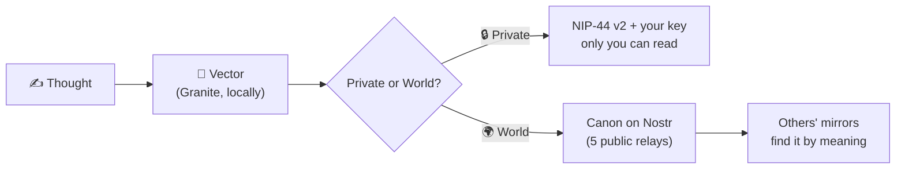
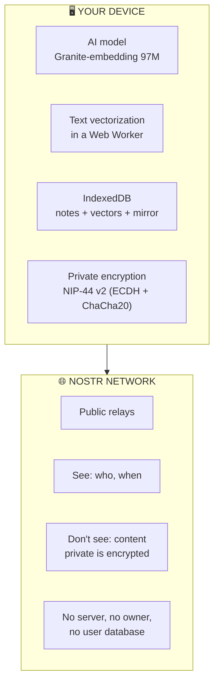

<p align="center">
  
  
  
  
  
  
</p>

<h1 align="center">🧠 NOOmium</h1>
<h3 align="center">A smart feed without the surveillance algorithm</h3>

<p align="center">
  <strong>Thoughts are found by meaning, not by keywords</strong>
</p>

<p align="center">
  <sub>🇷🇺 <a href="README.md">Русская версия</a></sub>
</p>

<p align="center">
  <a href="#-why-noomium">Why</a> •
  <a href="#-principles">Principles</a> •
  <a href="#-how-it-works">How it works</a> •
  <a href="#-real-life-examples">Examples</a> •
  <a href="#-security">Security</a> •
  <a href="#-getting-started">Get started</a> •
  <a href="#-faq">FAQ</a>
</p>

---

## 📌 Why NOOmium

A conventional feed hooks you by **sensory anchors** — outrage, envy, fear of missing out. It doesn't care *what* you think; it cares that you don't leave. Every scroll is a monetized minute of your attention.

**NOOmium flips the task.** The feed doesn't guess what will hook you — it finds what is **close to your thought**. Literally: every thought becomes a point in meaning-space, and NOOmium shows what lies nearby.

> You write *"the rain outside is calming"* — NOOmium surfaces a stranger's thought about the silence of a city at night. Not because the words matched. Because the **meaning** did.

This is not another feed to doom-scroll. It is a **second brain** — a thinking tool that connects ideas by their essence, not their packaging. It works even when you're not reading: every thought you record becomes a vector, every search — geometry.

---

## ✨ Principles

| Principle | The essence |
|-----------|-------------|
| **Meaning > words** | Every thought is a vector in meaning-space. Search by proximity, not keywords — across language borders too: the model is multilingual |
| **Privacy by Design** | Model, search, storage — local, in your browser. No server ever reads your thoughts |
| **You are not a profile** | Cryptography instead of registration. Your key is you — not a row in someone else's database |
| **The feed doesn't steer you** | Thresholds, modes, ranges — your settings, stored locally. No "improved relevance" at your expense |
| **Offline is the norm** | Plane, subway, forest — notes and search always work; publishing catches up once you're back online |
| **Yours stays yours** | Private thoughts are encrypted with your key. Relays see the fact of publication, never the content |

---

## ⚙️ How it works



| Action | What happens |
|--------|--------------|
| **You write** | A thought (up to 2,500 characters) becomes a vector — a point in meaning-space |
| **You search** | Start typing — the feed filters by meaning instantly. "Private ↔ World" is the visibility switch when sending |
| **Pin 📌** | Click a thought — it becomes the context: the feed shows everything in tune with it, from your base and from the network. A pinned thought becomes the "parent" of everything you write next |
| **Drift** | Type while pinned — the context smoothly shifts toward your text. You can walk away from someone else's thought toward your own, step by step |
| **Feed segments** | **Mine** — your thoughts · **World** — the network · **Insights** — broad semantic links: not "on the nose", but adjacent in meaning |
| **Resonance ◆** | How many thoughts by others grew out of yours. Your idea is no longer only yours |
| **Genealogy ↳** | "Inspired by" leads back to the source, step by step. Thoughts have a family tree |
| **Source ↩** | The original for thoughts forwarded from Telegram channels |
| **Base** | All your notes: search, sorting, statistics |
| **Deep layer** | Load room history — up to 90 days back in one move |

---

## 💡 Real-life examples

### 1. "Rain" — search without matching words

You wrote: *"The rain outside is calming. As if the city finally went quiet."*

NOOmium surfaced from the network: *"I love stepping out at 3 a.m. — the streets are empty, and for the first time all day I can hear myself."* A stranger, another city, zero shared words. Shared meaning.

### 2. Across the language border

You write in Russian: *"I can't focus — everything keeps tearing my attention apart."*

Among the finds: *deep work is about attention, not time*. The model is multilingual: it compared **meanings**, not words. Your second brain thinks in two languages at once.

### 3. A family tree for ideas

The thought about "the silence of a city at night" stuck with you — so you wrote your own, inspired by it. Your note remembers the kinship: the **↳ inspired-by** marker leads to the source, and the source has grown a **◆ 1**. A month later someone else finds your version — and the chain continues on its own. Thoughts in NOOmium are not posts in a vacuum; they are a family with a genealogy.

### 4. The subway — offline as the norm

A tunnel. You write, edit, search by meaning — everything works: the model and the database are local. "To World" quietly queues your thoughts. You surface at a station with signal — the queue drains, the canons are published. You won't even notice.

---

## 🧭 Glossary

| Term | What it means |
|------|---------------|
| **Thought** | A note up to 2,500 characters: private or public |
| **Pin** | Click a thought — it becomes the search context |
| **Drift** | Smoothly shifting the context with your own text while pinned |
| **Insights** | A feed segment with broad links (the range is configurable) |
| **Resonance ◆** | The number of authors whose thoughts grew out of yours |
| **Genealogy ↳** | The "inspired by" chain back to the original |
| **Mirror** | A local copy of others' public thoughts (up to 2,000; unused ones get evicted) |
| **Canon** | The signed "official" version of a note on the Nostr network |
| **Relay** | A public Nostr server-board. There are five; none is in charge |
| **Key** | Your account: a pair of cryptographic keys. The only way in |

---

## 🛡 Security



### 🔒 Security details

- **The model lives on your device.** The AI runs locally in a Web Worker — nobody reads your texts before vectorization. ~100 MB is downloaded once, then served from cache.

- **Private is encrypted.** NIP-44 v2 (ECDH + ChaCha20-Poly1305) — only you can decrypt it, on any device holding your key.

- **No middleman server.** The network is the open Nostr protocol over public relays. No central owner, no single point of failure, no "user base".

- **Signatures instead of trust.** Every event from the network is verified cryptographically (bip340): forged or tampered notes are discarded, no matter which relay delivered them.

- **The key on disk — optionally in a vault.** Since 1.1.0 you can store the key in an encrypted wrapper (ncryptsec, NIP-49) with a passphrase: on startup NOOmium asks for the passphrase, and the decrypted key lives only in session memory.

- **CSP.** A strict Content-Security-Policy limits script sources — a successful XSS is nearly impossible.

> ⚠️ **The key is unrecoverable.** This is not "forgot your password — we'll email a link". This is cryptography. Export your key under "Account & key" right after signup — and guard it like a passport.

---

## 🚀 Getting started

1. **Open NOOmium** in a browser or in Telegram (Mini App).
2. **First launch:** the app generates a key. Or sign in with an existing Nostr key (nsec / hex / ncryptsec).
3. **Install as an app:** Menu → "Install app" (PWA, an icon on your home screen).
4. **Wait for the model** (~100 MB, once; progress is shown in the header, afterwards it loads instantly from cache).
5. **Save your key:** "Account & key" → Show → Copy. Also make an archive: the same screen exports all your notes to JSON.

**Requirements:** a modern browser (Chrome, Firefox, Safari). The internet is only needed for sync: notes, search and private data work offline.

---

## 🎛 Make it yours

| Setting | What it does |
|---------|--------------|
| **Relevance threshold** (50–95%) | The minimum semantic similarity required to enter the feed |
| **Insights range** (5–30%) | How broad the links shown in "Insights" are |
| **Theme** | Light / dark (in Telegram, the messenger's theme is picked up) |
| **Language** | Russian / English — the interface is fully bilingual |
| **Archive** | Export/import all notes to JSON — a safety net if relays wipe history |

---

## ❓ FAQ

**— Is it free? What does it cost?**
There is nothing to pay for: no server, no subscription, no ads. The app is a static site, the network is public relays, the model downloads from an open CDN.

**— Where are my notes stored?**
In your browser (IndexedDB). Public copies spread across Nostr relays — removing them from "the world" is not possible (that's how the protocol works). Private notes never leave your device in the clear.

**— What if I lose my key?**
Nobody can recover it: not us, not the relays — nobody at all. The key is the account. That's why you export it right after signup.

**— Does it work offline?**
Fully: creating, editing, deleting, semantic search. Publications queue up and go out once the network returns.

**— How is this different from a feed on X/Twitter?**
There the platform's algorithm decides; here — proximity to your meaning. There the data lives on servers; here — with you. There the goal is to hold attention; here — to connect thoughts. See the principles table above.

**— Does it understand other languages?**
Yes: the model is multilingual, search works across language borders — a thought in English will find one in Russian, and vice versa.

**— Can I sign in with my own Nostr key?**
Yes: nsec, hex or ncryptsec. One key — one Nostr identity.

**— How do I delete everything?**
Menu → "Full reset": notes, cache, model — everything is wiped from the browser, back to first-launch state. Deleted public notes go out to the network as deletion facts — other users' mirrors clean them up on their own.

---

## 🆕 What's new in 1.1.0

The "Big cleanup" release — following a full code audit (68 findings closed):

- 🔐 **Key in a vault:** optional encrypted key storage (ncryptsec + passphrase)
- 🛡 **Signature verification** of every incoming event — forged records are discarded
- 🐛 Fixed: a rare loss of edits during background vectorization, the "Copy" button on first launch, connection recovery after a long offline period
- ⚡ The feed is noticeably lighter at scale (genealogy caching, surgical updates instead of full rebuilds)
- ⌨️ Accessibility: keyboard navigation for cards, focus traps in dialogs, reduced-motion support
- 🧹 ~300 lines of dead code removed

---

## 🧩 Tech stack

| Component | Technology |
|-----------|------------|
| **Platform** | PWA + Telegram Mini App |
| **AI model** | granite-embedding-97m-multilingual-r2 (ONNX, q8) — locally in a Web Worker |
| **Storage** | IndexedDB: notes, vectors, mirror |
| **Network** | Nostr protocol: canons kind 30078 + queries 21000/21001 |
| **Encryption** | NIP-44 v2 (private) · NIP-49 ncryptsec (key) |
| **Server** | None |
| **Language** | JavaScript (ES modules, no build step) |
| **License** | Apache 2.0 |

---

## 📎 Links

- 🌐 **Web version (PWA)** — installs as an app
- 📱 **Telegram Mini App** — runs natively inside Telegram
- 📂 **Source code** — open

---

## 📄 License

```text
Copyright © 2026 NOOmium

Licensed under the Apache License, Version 2.0 (the "License");
you may not use this file except in compliance with the License.
You may obtain a copy of the License at:

    http://www.apache.org/licenses/LICENSE-2.0

Unless required by applicable law or agreed to in writing, software
distributed under the License is distributed on an "AS IS" BASIS,
WITHOUT WARRANTIES OR CONDITIONS OF ANY KIND, either express or implied.
See the License for the specific language governing permissions and
limitations under the License.
```

---

<p align="center">
  <strong>Made with ❤️ for those who value meaning over noise.</strong>
</p>
