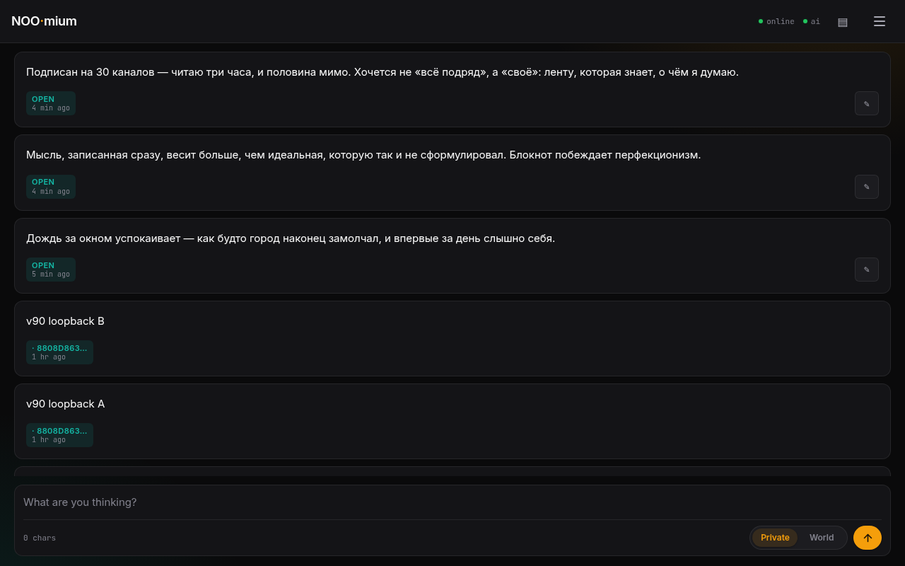
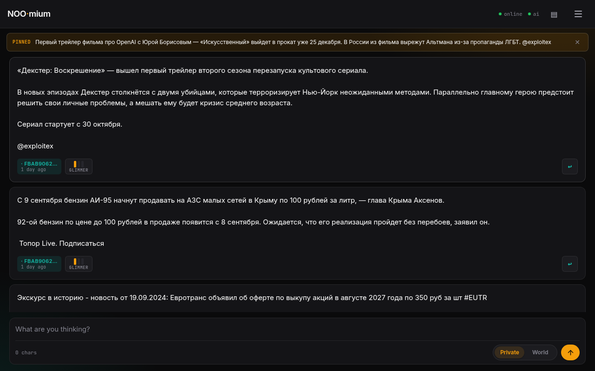
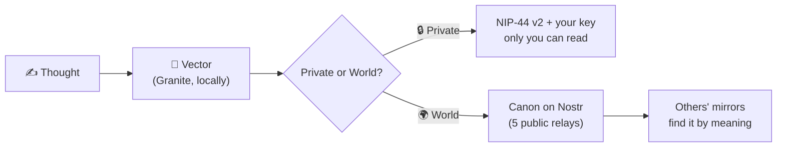

<p align="center">
  
  
  
  
  
  
</p>

<h1 align="center">🧠 NOOmium</h1>

<h3 align="center">A notebook of thoughts that became a social network</h3>

<p align="center">
  <strong>The world's shared second brain.</strong> You write thoughts — the smart feed gathers what is close in meaning: yours and from the world.<br>
  The pure essence of social networks: no feed of 30 channels, no doomscrolling, no noise.
</p>

<p align="center">
  <a href="https://tonysmol.github.io/NOOmium/"></a>
  &nbsp;
  <sub>🇷🇺 <a href="README.md">Русская версия</a></sub>
</p>

<p align="center">
  
</p>
<p align="center"><sub>The live feed: fresh thoughts on top, a Telegram-channel repost with a “source” button below</sub></p>

<p align="center">
  <a href="#-manifesto">Manifesto</a> ·
  <a href="#-what-noomium-is">What it is</a> ·
  <a href="#-value-today">Value</a> ·
  <a href="#-real-life-examples">Examples</a> ·
  <a href="#-getting-started">Get started</a> ·
  <a href="#-faq">FAQ</a> ·
  <a href="#%EF%B8%8F-technical-part">Tech part</a>
</p>

---

## 🧭 Manifesto

Subscribed to 30 Telegram channels? That's **three hours of reading a day** — and half of it wasted: repeats, ads, "urgent" news you'll forget by evening.

A conventional social network doesn't solve this problem — it **manufactures** it. The feed hooks you by the nerves: outrage, envy, fear of missing out. It doesn't care *what* you think. It cares that you don't leave. Every scroll is a monetized minute of your attention.

**NOOmium is the pure essence of social networks.** Everything but the thoughts has been removed. No likes, no ratings, no infinite feed. Instead:

- **You write** — thoughts pile up in a private notebook and stay yours forever.
- **You read** — a smart feed: not "everything", but what resonates with your thoughts.
- **You meet** — someone else's thought that is closer than a subscription: matched not by words, but by meaning.

> You write *"the rain outside is calming"* — NOOmium surfaces a stranger's thought about the silence of a city at night. Not because the words matched. Because the **meaning** did.

Every thought here is a point in meaning-space. Your notebook is a **second brain, private**. The feed of everyone's thoughts is a **second brain, shared**. A worldwide one.

---

## ✨ What NOOmium is

| | What it does |
|---|---|
| 📝 **Notebook** | Thoughts up to 2,500 characters, private or public. Works offline: plane, subway, forest. Archive — export and import to JSON in one file |
| 🧠 **Smart feed** | Built **by meaning**, not by chronology and not by an engagement algorithm. What counts as "similar" is your call (threshold and breadth of links — in settings). Segments: **Mine · World · Insights** |
| 🌍 **World** | An open network of thoughts. Everyone has their own notebook; everyone shares one protocol. Thoughts have a family tree and a source. No owner, no "user database" |

**A couple of gestures — and the feed is yours:**

| Gesture | What happens |
|---------|--------------|
| **You write** | A thought becomes a vector — a point in meaning-space |
| **You search** | Start typing — the feed filters by meaning instantly, before you even send |
| **Pin 📌** | Click a thought — it becomes the context: the feed rebuilds and shows everything in tune, from your base and from the network |
| **Drift** | Type while pinned — the context smoothly shifts toward your text. You can walk from someone else's thought to your own, step by step |
| **Resonance ◆** | How many other people's thoughts grew out of yours. Your idea is no longer only yours |
| **Genealogy ↳** | "Inspired by" leads back to the source, step by step. Thoughts have a family tree |
| **Source ↩** | The original for thoughts forwarded from Telegram channels |
| **Base** | All your notes: search, sorting, statistics |
| **Deeper** | World history up to 90 days back — in one move |

---

## 💰 Value today

### If you read

- You subscribe not to channels but **to meanings** — the feed assembles itself around what you think about.
- Instead of three hours of scrolling thirty channels — **the concentrate**: only what resonates with you. Half of the "noise" is filtered out before it reaches the screen.
- No need to open social networks and doomscroll: the essence is already in your feed. Opened — read your own — closed.
- It's free: no server, subscription or ads — there is nothing for them to run on.

### If you run a Telegram channel

Channels already repost their posts here — with a link to the original. Why it pays off:

- **Every post keeps working.** In a channel a post dies within a day — in NOOmium a thought is found by meaning months later: it reaches those thinking about the same thing *right now*.
- **Organic inflow of subscribers.** A reader meets your thought in their feed → clicks "source ↩" → arrives at the channel already interested.
- **Precise targeting.** A repost is shown only to those whose feed resonates with the topic — not "everyone". Promotion hits the target exactly, because everyone's feed is their own.
- **Posts don't get lost.** From the channel, a thought spreads to readers' mirrors and stays findable — ads and repeats don't push it out.

> The channel doesn't need to change anything: the same content — just a long life for every post, and subscribers who came for the meaning.

---

## 💡 Real-life examples

### 1. "Rain" — search without matching words

You wrote: *"The rain outside is calming. As if the city finally went quiet."*

NOOmium surfaced from the world: *"I love going out at 3 a.m. — the streets are empty, and for the first time all day I can hear myself."* A stranger, another city, zero shared words. Shared meaning.

### 2. Across the language border

You write in Russian: *"can't focus — everything tears my attention apart"*.

Among the finds — *deep work is about attention, not time*. The model is multilingual: it compared not the words, but the **meanings**. The second brain thinks in two languages at once.

### 3. A channel post that outlives the channel's feed

You run a markets channel and reposted a piece on "RWA volumes hit a record". A month later, someone who noted "curious where tokenized assets are heading" gets your post in their feed — by meaning, not chronology. They click "source ↩" — and subscribe. In the channel itself, the post would have drowned under a hundred news items by then.

### 4. Subway — offline as the norm

A tunnel. You write, edit, search by meaning — everything works: the model and the database are local. "To World" queues your thoughts. You surface at a station with network — the queue drains. You won't even notice.

<p align="center">
  
</p>
<p align="center"><sub>In your pocket: the same feed, the same offline</sub></p>

<p align="center">
  
</p>
<p align="center"><sub>Pin: pin a thought — the feed rebuilds by meaning. The “In tune · Serendipity · Glimpse” labels show how resonant each card is</sub></p>

<p align="center">
  <a href="https://tonysmol.github.io/NOOmium/"></a>
</p>

---

## 🚀 Getting started

1. **Open NOOmium** — [in a browser](https://tonysmol.github.io/NOOmium/) or in Telegram. The key is generated for you: no sign-up, email or phone.
2. **Wait for the model** (~120 MB, once; progress is in the header, then it's instant from cache).
3. **Write your first thought.** Then click it — and watch the feed rebuild by meaning.
4. **Save the key**: Menu → "Account & key" → Show → Copy. A new device needs only the key — the feed refills with your notes.
5. **Set a password on the key** (same place): the key gets encrypted (ncryptsec), and login asks only for the password.

Install as an app: in the browser — "Install app", the icon lands on your home screen (PWA). Interface — Russian or English, switchable in the menu.

> ⚠️ **The key is unrecoverable.** This is not "forgot password — we'll email a link". This is cryptography. No one will recover it: not us, not the relays. The key is the account. Export it right away and keep it like a passport.

---

## ❓ FAQ

<details>
<summary><strong>Is it free? What does it cost?</strong></summary>

There is nothing to charge for: no server, no subscription, no ads. The app is a static site, the network is public relays, the model downloads once from an open CDN.
</details>

<details>
<summary><strong>Where are my notes stored?</strong></summary>

In your browser (IndexedDB). Public copies spread across open relays — they cannot be removed from the world (that's how the protocol works). Private ones never leave your device in the open: they are encrypted with your key.
</details>

<details>
<summary><strong>What if I lose the key?</strong></summary>

No one will recover it. The key is the account — no second pair exists. That's why: export right after signup, optionally set a password on the key.
</details>

<details>
<summary><strong>Does it work offline?</strong></summary>

Yes, fully: create, edit, delete, meaning-based search. Publications queue up and drain once the network returns.
</details>

<details>
<summary><strong>How is it different from the feed in Telegram/X?</strong></summary>

There the platform's algorithm decides — here, proximity to your meaning. There, data lives on servers — here, with you. There, the goal is to hold attention — here, to connect thoughts.
</details>

<details>
<summary><strong>Does it understand other languages?</strong></summary>

Yes: the model is multilingual, search works across the language border — a thought in Russian finds one in English and vice versa. Interface: Russian / English.
</details>

<details>
<summary><strong>Can I log in with my own Nostr key?</strong></summary>

Yes: nsec, hex or ncryptsec. One key — one identity in Nostr.
</details>

<details>
<summary><strong>How do I delete everything?</strong></summary>

Menu → "Full reset": notes, cache, the model — everything is wiped from the browser, back to first-run state. Deleted public notes go out to the network as deletion facts — other users' mirrors clean them up themselves.
</details>

---

## 🆕 What's new in 1.2.0

- **Live transport.** Relay subscriptions rewritten: thoughts written on one device are visible on another; logging in with the key refills the feed. A failed publication no longer stays silent — the reason shows in the console.
- **Onboarding doesn't pop up.** The "How it works" modal never opens on its own — only via a button in settings. Nobody read it, nobody will.
- **Cleanup.** Dead code and patch-notes removed, comments — JSDoc only.

History: `1.2.0 · 1.1.3 · 1.1.2 · 1.1.0`

---

---

# 🛠️ Technical part

> Below — for the curious. To use NOOmium you don't need any of this: it's just a website.

### How it works



A thought is vectorized locally in a Web Worker and lives in three places: the browser (source of truth), the mirror (up to 2,000 other people's public thoughts, unused ones evicted), the Nostr network (state canon kind 30078, queries 21000/21001). Fresh — 7 days, history depth — 90 days. Incoming events are verified cryptographically (bip340): a forgery is dropped, whatever relay it came from.

<details>
<summary><strong>🔒 Security — details</strong></summary>

- **The model is on your device.** The AI runs locally in a Web Worker — texts go nowhere for vectorization. ~120 MB downloaded once, then from cache.
- **Private is encrypted.** NIP-44 v2 (ECDH + ChaCha20-Poly1305) — only you can decrypt, on any device with your key.
- **The key — optionally in a safe.** ncryptsec (NIP-49) with a password: the decrypted key lives only in session memory.
- **No middleman server.** The network is the open Nostr protocol, 5 public relays. No owner, no single point of failure, no "user database".
- **Signatures instead of trust.** Every incoming event is verified (bip340).
- **CSP.** Content-Security-Policy with inline-script hashes — a successful XSS is nearly impossible.
</details>

<details>
<summary><strong>📖 NOOmium vocabulary</strong></summary>

| Term | Meaning |
|------|---------|
| **Thought** | A note up to 2,500 characters: private or public |
| **Pin** | Click a thought — it becomes the search context |
| **Drift** | Smoothly shifting the context with your own text while pinned |
| **Insights** | Feed segment with broad meaning links (range is configurable) |
| **Resonance ◆** | The number of authors whose thoughts grew out of yours |
| **Genealogy ↳** | The "inspired by" chain back to the source |
| **Mirror** | A local copy of other people's public thoughts (up to 2,000; unused ones evicted) |
| **Canon** | The signed "official" version of a note on the Nostr network |
| **Relay** | A public Nostr bulletin server. There are five, none is the main one |
| **Key** | Your account: a cryptographic key pair. The only way in |
</details>

### Stack

| Component | Technology |
|-----------|------------|
| **Platform** | PWA + Telegram Mini App |
| **AI model** | granite-embedding-97m-multilingual-r2 (ONNX, q8) — locally in a Web Worker, transformers.js 3.8.1 |
| **Storage** | IndexedDB: notes, vectors, mirror |
| **Network** | Nostr: nostr-tools 2.25.2, state canons kind 30078, queries 21000/21001 |
| **Encryption** | NIP-44 v2 (private) · NIP-49 ncryptsec (key) |
| **Server** | None |
| **Code** | Vanilla JavaScript, ES modules, no build: 37 modules across 8 layers, JSDoc comments |
| **License** | Apache 2.0 |

Deploy — 5 files, no build: copy to any static hosting.

### Links

- 🌐 **App (PWA)** — <https://tonysmol.github.io/NOOmium/>
- 📱 **Telegram Mini App** — <https://tonysmol.github.io/NOOmium/>
- 📂 **Source code** — <https://tonysmol.github.io/NOOmium/>

### License

```text
Copyright © 2026 NOOmium

Licensed under the Apache License, Version 2.0 (the "License");
you may not use this file except in compliance with the License.
You may obtain a copy of the License at:

    http://www.apache.org/licenses/LICENSE-2.0

Unless required by applicable law or agreed to in writing, software
distributed under the License is distributed on an "AS IS" BASIS,
WITHOUT WARRANTIES OR CONDITIONS OF ANY KIND, either express or implied.
See the License for the specific language governing permissions and
limitations under the License.
```

---

<p align="center">
  <strong>NOOmium — made for those who value meaning over noise.</strong><br>
  <sub>🧠 Write thoughts. Read meanings. The second brain — yours and shared.</sub>
</p>
