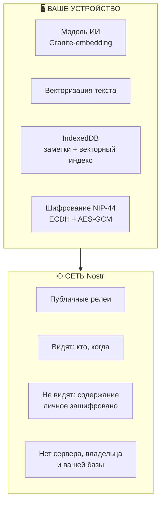

<p align="center">
  
  
  
  
  
</p>

<h1 align="center">🧠 NOOmium</h1>
<h3 align="center">Умная лента без алгоритма-надзирателя</h3>

<p align="center">
  <strong>Мысли ищутся по значению, а не по словам</strong>
</p>

<p align="center">
  <a href="#-зачем">Зачем</a> •
  <a href="#-принципы">Принципы</a> •
  <a href="#-как-это-работает">Как работает</a> •
  <a href="#-безопасность">Безопасность</a> •
  <a href="#-начало-работы">Начать</a>
</p>

---

## 📌 Зачем

Обычная лента цепляет вас за **сенсорные якоря** — гнев, зависть, страх упустить. Чем дольше вы листаете, тем лучше для платформы.

**NOOmium** ищет то, что близко вашей мысли. Чем точнее попадание — тем ценнее для вас.

> Вы пишете *«дождь за окном успокаивает»* — NOOmium найдёт мысль незнакомого человека о тишине ночного города. Не потому что совпали слова. Потому что совпал **смысл**.

Это не очередная лента для скроллинга. Это **второй мозг** — инструмент для мышления, который соединяет идеи по их сути, а не по обёртке.

---

## ✨ Принципы

| Принцип | Суть |
|---------|------|
| **Смысл > слова** | Каждая мысль — вектор в пространстве смыслов. Поиск по близости, не по ключевым словам |
| **Privacy by Design** | Модель, поиск, хранение — локально. Никакой сервер не читает ваши мысли |
| **Вы — не профиль** | Криптография вместо регистрации. Ключ — это вы, а не строка в чужой базе |
| **Лента не рулит вами** | Пороги, режимы, диапазоны — настраиваются локально, без внешнего влияния |
| **Офлайн — норма** | Самолёт, метро, лес — заметки и поиск работают всегда |
| **Своё — только ваше** | Личное зашифровано ключом. Даже релеи видят только факт, не содержание |

---

## ⚙️ Как это работает

| Действие | Что происходит |
|----------|----------------|
| **Пишете** | Мысль становится вектором — точкой в пространстве смыслов |
| **Ищете** | Начинаете печатать — лента фильтруется по смыслу мгновенно |
| **Пин 📌** | Клик по мысли — она становится контекстом. Лента показывает всё созвучное |
| **Дрейф** | Печатаете при пине — контекст плавно смещается к вашему тексту. Можно уйти от чужой мысли к своей — шаг за шагом |
| **Мир 🌍** | Отправляете мысль в сеть — её найдут другие по смыслу, из любой точки мира |
| **Резонанс ◆** | Показывает, сколько мыслей породила ваша. Ваша идея — уже не только ваша |
| **Генеалогия ↳** | Ведёт к источнику мысли, шаг за шагом. Мысли имеют родословную |
| **Источник ↩** | Оригинал (для мыслей из Telegram-каналов) |

---

## 🛡 Безопасность



### 🔒 Детали безопасности

- **Модель на устройстве**  
  ИИ работает локально — никто не читает ваши тексты до векторизации.

- **Личное зашифровано**  
  NIP-44 (ECDH + AES-GCM) — расшифровать можете только вы.

- **Нет сервера-посредника**  
  Сеть — Nostr-протокол, публичные релеи. Нет центрального владельца, нет единой точки отказа.

- **Ключ — единственный вход**  
  Потеряли — никто не восстановит.

> ⚠️ **Ключ невосстановим.** Это не «забыл пароль — на почту придёт ссылка». Это криптография. Экспортируйте ключ в «Аккаунт и ключ» сразу после регистрации.

---

## 🚀 Начало работы

1. Откройте NOOmium в браузере или Telegram
2. Меню → «Установить приложение» (PWA, на домашний экран)
3. Дождитесь модели (~100 МБ, один раз, дальше из кэша)
4. Сохраните ключ — «Аккаунт и ключ» → Показать → Скопировать

**Требования:** современный браузер (Chrome, Firefox, Safari). Интернет — только для синхронизации; заметки и поиск работают офлайн.

---

## 🧩 Технический стек

| Компонент | Технология |
|-----------|------------|
| **Платформа** | PWA + Telegram Mini App |
| **AI-модель** | Granite-embedding (ONNX q8, локально) |
| **Хранилище** | IndexedDB (заметки + векторный индекс) |
| **Сеть** | Nostr-протокол, публичные релеи |
| **Шифрование** | NIP-44 (ECDH + AES-GCM) |
| **Сервер** | Отсутствует |
| **Язык** | JavaScript (ES modules) |
| **Лицензия** | Apache 2.0 |

---

## 📎 Ссылки

- 🌐 **WEB версия (PWA)** — устанавливается как приложение  
- 📱 **Telegram Mini App** — работает нативно в Telegram  
- 📂 **Исходный код** — открыт

---

## 📄 Лицензия

```text
Copyright © 2026 NOOmium

Licensed under the Apache License, Version 2.0 (the "License");
you may not use this file except in compliance with the License.
You may obtain a copy of the License at:

    http://www.apache.org/licenses/LICENSE-2.0

Unless required by applicable law or agreed to in writing, software
distributed under the License is distributed on an "AS IS" BASIS,
WITHOUT WARRANTIES OR CONDITIONS OF ANY KIND, either express or implied.
See the License for the specific language governing permissions and
limitations under the License.
```

---

<p align="center">
  <strong>Сделано с ❤️ для тех, кто ценит смысл, а не шум.</strong>
</p>
