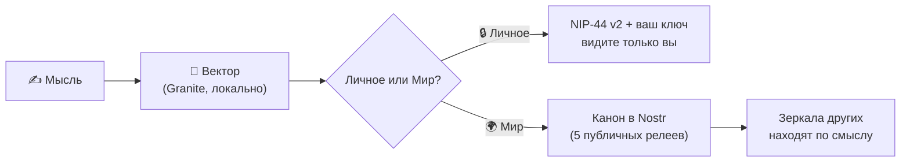
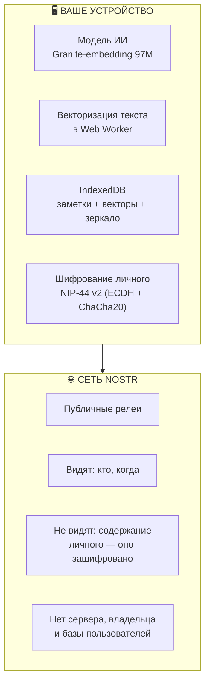

<p align="center">
  
  
  
  
  
  
</p>

<h1 align="center">🧠 NOOmium</h1>
<h3 align="center">Умная лента без алгоритма-надзирателя</h3>

<p align="center">
  <strong>Мысли ищутся по значению, а не по словам</strong>
</p>

<p align="center">
  <sub>🇬🇧 <a href="README-en.md">English version</a></sub>
</p>

<p align="center">
  <a href="#-зачем-noomium">Зачем</a> •
  <a href="#-принципы">Принципы</a> •
  <a href="#-как-это-работает">Как работает</a> •
  <a href="#-живые-примеры">Примеры</a> •
  <a href="#-безопасность">Безопасность</a> •
  <a href="#-начало-работы">Начать</a> •
  <a href="#-faq">FAQ</a>
</p>

---

## 📌 Зачем NOOmium

Обычная лента цепляет вас за **сенсорные якоря** — гнев, зависть, страх упустить. Ей неважно, *что* вы думаете; ей важно, чтобы вы не уходили. Каждый скролл — монетизированная минута вашего внимания.

**NOOmium переворачивает задачу.** Лента не угадывает, чем вас зацепить, — она находит то, что **близко вашей мысли**. Буквально: каждая мысль превращается в точку в пространстве смыслов, и NOOmium показывает то, что рядом с ней.

> Вы пишете *«дождь за окном успокаивает»* — NOOmium найдёт мысль незнакомого человека о тишине ночного города. Не потому что совпали слова. Потому что совпал **смысл**.

Это не очередная лента для скроллинга. Это **второй мозг** — инструмент для мышления, который соединяет идеи по их сути, а не по обёртке. Он работает, даже когда вы не читаете: каждая записанная мысль становится вектором, каждый поиск — геометрией.

---

## ✨ Принципы

| Принцип | Суть |
|---------|------|
| **Смысл > слова** | Каждая мысль — вектор в пространстве смыслов. Поиск по близости, а не по ключевым словам — и через границы языков: модель мультиязычная |
| **Privacy by Design** | Модель, поиск, хранение — локально, в вашем браузере. Ни один сервер не читает ваши мысли |
| **Вы — не профиль** | Криптография вместо регистрации. Ключ — это вы, а не строка в чужой базе |
| **Лента не рулит вами** | Пороги, режимы, диапазоны — ваши настройки, хранятся локально. Никакого «улучшения релевантности» за ваш счёт |
| **Офлайн — норма** | Самолёт, метро, лес — заметки и поиск работают всегда; публикация догонит, когда появится сеть |
| **Своё — только ваше** | Личное шифруется вашим ключом. Релеи видят факт публикации, но не содержание |

---

## ⚙️ Как это работает



| Действие | Что происходит |
|----------|----------------|
| **Пишете** | Мысль (до 2 500 символов) становится вектором — точкой в пространстве смыслов |
| **Ищете** | Начинаете печатать — лента фильтруется по смыслу мгновенно. «Личное ↔ Мир» — тумблер видимости при отправке |
| **Пин 📌** | Клик по мысли — она становится контекстом: лента покажет всё созвучное, из вашей базы и из сети. Закреплённая мысль становится «родителем» для всего, что вы напишете следом |
| **Дрейф** | Печатаете при пине — контекст плавно смещается к вашему тексту. Можно уйти от чужой мысли к своей — шаг за шагом |
| **Сегменты ленты** | **Моё** — ваши мысли · **Мир** — сеть · **Озарения** — широкие смысловые связи: не «в лоб», а рядом по смыслу |
| **Резонанс ◆** | Сколько чужих мыслей выросло из вашей. Ваша идея — уже не только ваша |
| **Генеалогия ↳** | «По мотивам» ведёт к источнику мысли, шаг за шагом. Мысли имеют родословную |
| **Источник ↩** | Оригинал для мыслей, пересланных из Telegram-каналов |
| **База** | Все ваши заметки: поиск, сортировка, статистика |
| **Слой вглубь** | Загрузка истории комнаты — до 90 дней назад одним движением |

---

## 💡 Живые примеры

### 1. «Дождь» — поиск без совпадения слов

Вы записали: *«Дождь за окном успокаивает. Как будто город наконец замолчал»*.

NOOmium поднял из сети: *«Люблю выходить в три ночи — улицы пустые, и впервые за день слышно себя»*. Незнакомец, другой город, ноль общих слов. Общий смысл.

### 2. Через границу языка

Вы пишете по-русски: *«не могу сосредоточиться — всё разрывает внимание»*.

Среди находок — *deep work is about attention, not time*. Модель мультиязычная: она сравнила не слова, а **смыслы**. Ваш второй мозг думает на двух языках одновременно.

### 3. Родословная идеи

Мысль про «тишину ночного города» зацепила — вы написали свою, по мотивам. Ваша заметка помнит родство: маркер **↳ по мотивам** ведёт к источнику, у источника вырос **◆ 1**. Через месяц вашу версию найдёт кто-то третий — и цепочка продолжится сама. Мысли в NOOmium — не посты в вакууме, а семья с генеалогией.

### 4. Метро — офлайн как норма

Тоннель. Вы пишете, редактируете, ищете по смыслу — всё работает: модель и база локальные. «В Мир» ставит мысли в очередь. Вынырнули на станцию с сетью — очередь ушла, каноны опубликовались. Вы этого даже не заметили.

---

## 🧭 Словарь NOOmium

| Термин | Что значит |
|--------|------------|
| **Мысль** | Заметка до 2 500 символов: личная или публичная |
| **Пин** | Клик по мысли — она становится контекстом поиска |
| **Дрейф** | Плавная смена контекста своим текстом при пине |
| **Озарения** | Сегмент ленты с широкими связями (диапазон настраивается) |
| **Резонанс ◆** | Число авторов, чьи мысли выросли из вашей |
| **Генеалогия ↳** | Цепочка «по мотивам» до первоисточника |
| **Зеркало** | Локальная копия чужих публичных мыслей (до 2 000; неиспользуемые вытесняются) |
| **Канон** | Подписанная «официальная» версия заметки в сети Nostr |
| **Релей** | Публичный сервер-доска Nostr. Их пять, ни один не главный |
| **Ключ** | Ваш аккаунт: пара криптографических ключей. Единственный вход |

---

## 🛡 Безопасность



### 🔒 Детали безопасности

- **Модель на устройстве.** ИИ работает локально в Web Worker — никто не читает ваши тексты до векторизации. ~100 МБ скачиваются один раз, дальше — из кэша.

- **Личное зашифровано.** NIP-44 v2 (ECDH + ChaCha20-Poly1305) — расшифровать можете только вы, на любом устройстве с вашим ключом.

- **Нет сервера-посредника.** Сеть — открытый протокол Nostr, публичные релеи. Нет центрального владельца, нет единой точки отказа, нет «базы юзеров».

- **Подписи вместо доверия.** Каждое событие из сети проверяется криптографически (bip340): поддельные или подменённые заметки отбрасываются, каким бы релеем они ни пришли.

- **Ключ на диске — по желанию в сейфе.** С версии 1.1.0 ключ можно хранить в зашифрованной обёртке (ncryptsec, NIP-49) с паролем: при запуске NOOmium спросит пароль, расшифрованный ключ живёт только в памяти сессии.

- **CSP.** Политика Content-Security-Policy жёстко ограничивает источники скриптов — успешный XSS почти исключён.

> ⚠️ **Ключ невосстановим.** Это не «забыл пароль — на почту придёт ссылка». Это криптография. Экспортируйте ключ в «Аккаунт и ключ» сразу после регистрации — и храните как паспорт.

---

## 🚀 Начало работы

1. **Откройте NOOmium** в браузере или в Telegram (Mini App).
2. **Первый запуск:** приложение сгенерирует ключ. Или войдите существующим Nostr-ключом (nsec / hex / ncryptsec).
3. **Установите как приложение:** Меню → «Установить приложение» (PWA, иконка на домашнем экране).
4. **Дождитесь модели** (~100 МБ, один раз; прогресс виден в шапке, дальше — мгновенно из кэша).
5. **Сохраните ключ:** «Аккаунт и ключ» → Показать → Скопировать. Плюс сделайте архив: там же — экспорт всех заметок в JSON.

**Требования:** современный браузер (Chrome, Firefox, Safari). Интернет нужен только для синхронизации: заметки, поиск и личное работают офлайн.

---

## 🎛 Настройки под себя

| Настройка | Что делает |
|-----------|------------|
| **Порог релевантности** (50–95%) | Минимальное смысловое сходство для попадания в ленту |
| **Диапазон озарений** (5–30%) | Насколько широкие связи показывать в «Озарениях» |
| **Тема** | Светлая / тёмная (в Telegram подхватывается тема мессенджера) |
| **Язык** | Русский / English — интерфейс полностью двуязычен |
| **Архив** | Экспорт/импорт всех заметок в JSON — страховка, если релеи очистят историю |

---

## ❓ FAQ

**— Это бесплатно? Сколько стоит?**
Нечему стоить: нет сервера, нет подписки, нет рекламы. Приложение — статический сайт, сеть — публичные релеи, модель качается с открытого CDN.

**— Что если потеряю ключ?**
Никто не восстановит: ни мы, ни релеи — вообще никто. Ключ = аккаунт. Поэтому — экспорт сразу после регистрации.

**— Работает офлайн?**
Да, полностью: создание, редактирование, удаление, смысловой поиск. Публикации копятся в очереди и уходят при появлении сети.

**— Чем это отличается от ленты в привычных соцсетях?**
Там решает алгоритм платформы, здесь — близость к вашему смыслу. Там данные на серверах, здесь — у вас. Там цель — удержать внимание, здесь — соединить мысли. См. таблицу выше.

**— Понимает ли другие языки?**
Да: модель мультиязычная, поиск работает через границу языков — мысль на русском найдёт мысль на английском и наоборот.

**— Могу ли войти со своим Nostr-ключом?**
Да: nsec, hex или ncryptsec. Один ключ — одна идентичность в Nostr.

**— Как удалить всё?**
Меню → «Полный сброс»: заметки, кэш, модель — всё из браузера, состояние «как первый запуск». Удалённые публичные заметки уходят в сеть как факты удаления — зеркала других пользователей вычищают их сами.

---

## 🧩 Технический стек

| Компонент | Технология |
|-----------|------------|
| **Платформа** | PWA + Telegram Mini App |
| **AI-модель** | granite-embedding-97m-multilingual-r2 (ONNX, q8) — локально в Web Worker |
| **Хранилище** | IndexedDB: заметки, векторы, зеркало |
| **Сеть** | Nostr-протокол: каноны kind 30078 + запросы 21000/21001 |
| **Шифрование** | NIP-44 v2 (личное) · NIP-49 ncryptsec (ключ) |
| **Сервер** | Отсутствует |
| **Язык** | JavaScript (ES-модули, без сборки) |
| **Лицензия** | Apache 2.0 |

---

## 📎 Ссылки

- 🌐 **WEB-версия (PWA)** — устанавливается как приложение
- 📱 **Telegram Mini App** — работает нативно в Telegram
- 📂 **Исходный код** — открыт

---

## 📄 Лицензия

```text
Copyright © 2026 NOOmium

Licensed under the Apache License, Version 2.0 (the "License");
you may not use this file except in compliance with the License.
You may obtain a copy of the License at:

    http://www.apache.org/licenses/LICENSE-2.0

Unless required by applicable law or agreed to in writing, software
distributed under the License is distributed on an "AS IS" BASIS,
WITHOUT WARRANTIES OR CONDITIONS OF ANY KIND, either express or implied.
See the License for the specific language governing permissions and
limitations under the License.
```

---

<p align="center">
  <strong>Сделано с ❤️ для тех, кто ценит смысл, а не шум.</strong>
</p>
