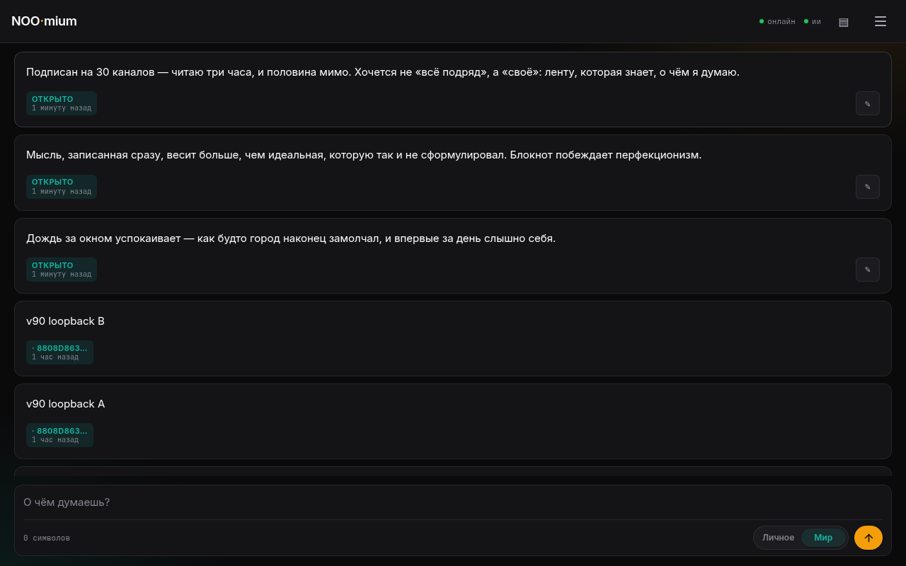
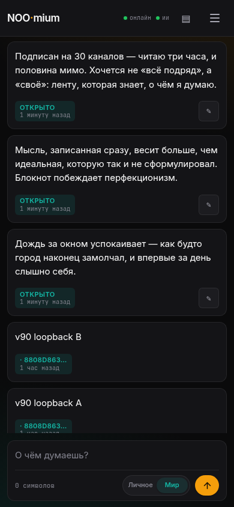
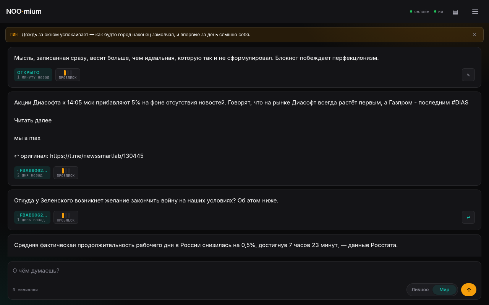
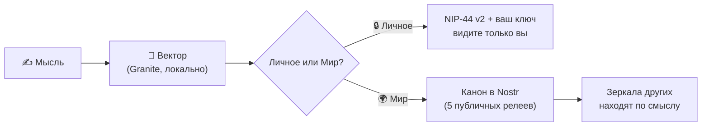

<p align="center">
  
  
  
  
  
  
</p>

<h1 align="center">🧠 NOOmium</h1>

<h3 align="center">Блокнот мыслей, ставший социальной сетью</h3>

<p align="center">
  <strong>Мировой второй мозг.</strong> Вы пишете мысли — умная лента собирает близкие по смыслу: ваши и из мира.<br>
  Чистая эссенция соцсетей: без лент из 30 каналов, без думскролла, без мусора.
</p>

<p align="center">
  <a href="https://tonysmol.github.io/NOOmium/"></a>
  &nbsp;
  <sub>🇬🇧 <a href="README.en.md">English version</a></sub>
</p>

<p align="center">
  
</p>
<p align="center"><sub>Живая лента: сверху — свежие мысли, ниже — репост из Telegram-канала с кнопкой «источник»</sub></p>

<p align="center">
  <a href="#-манифест">Манифест</a> ·
  <a href="#-что-такое-noomium">Что это</a> ·
  <a href="#-польза-сегодня">Польза</a> ·
  <a href="#-живые-примеры">Примеры</a> ·
  <a href="#-как-начать">Начать</a> ·
  <a href="#-faq">FAQ</a> ·
  <a href="#%EF%B8%8F-техническая-часть">Техчасть</a>
</p>

---

## 🧭 Манифест

Подписаны на 30 Telegram-каналов? Это **три часа чтения в день** — и половина из них мимо: повторы, реклама, «срочные» новости, которые забудутся к вечеру.

Обычная соцсеть не решает эту проблему — она её **производит**. Лента цепляет вас за нервы: гнев, зависть, страх упустить. Ей неважно, *что* вы думаете. Ей важно, чтобы вы не уходили. Каждый скролл — монетизированная минута вашего внимания.

**NOOmium — чистая эссенция соцсетей.** Из них убрано всё, кроме главного — мыслей. Никаких лайков, рейтингов и бесконечной ленты. Вместо этого:

- **Пишете** — мысли копятся в личном блокноте и остаются вашими навсегда.
- **Читаете** — умную ленту: она показывает не «всё подряд», а созвучное вашим мыслям.
- **Встречаете** — чужую мысль, которая ближе, чем подписка: не по словам, а по смыслу.

> Вы пишете *«дождь за окном успокаивает»* — NOOmium найдёт мысль незнакомого человека о тишине ночного города. Не потому что совпали слова. Потому что совпал **смысл**.

Каждая мысль здесь — точка в пространстве смыслов. Ваш блокнот — **второй мозг, личный**. Лента всех мыслей — **второй мозг, общий**. Мировой.

---

## ✨ Что такое NOOmium

| | Что делает |
|---|---|
| 📝 **Блокнот** | Мысли до 2 500 символов, личные или публичные. Работает офлайн: самолёт, метро, лес. Архив — экспорт и импорт в JSON одним файлом |
| 🧠 **Умная лента** | Собирается **по смыслу**, а не по хронологии и не по алгоритму удержания. Что считать «похожим» — решаете вы (порог и широта связей — в настройках). Сегменты: **Моё · Мир · Озарения** |
| 🌍 **Мир** | Открытая сеть из мыслей. У каждого — свой блокнот, у всех — общий протокол. Мысли имеют родословную и источник. Никакого владельца и «базы юзеров» |

**Пара жестов — и лента ваша:**

| Жест | Что происходит |
|------|----------------|
| **Пишете** | Мысль превращается в вектор — точку в пространстве смыслов |
| **Ищете** | Начинаете печатать — лента фильтруется по смыслу мгновенно, ещё до отправки |
| **Пин 📌** | Клик по мысли — она становится контекстом: лента пересобирается и показывает всё созвучное, из вашей базы и из сети |
| **Дрейф** | Печатаете при пине — контекст плавно смещается к вашему тексту. Можно уйти от чужой мысли к своей — шаг за шагом |
| **Резонанс ◆** | Сколько чужих мыслей выросло из вашей. Ваша идея — уже не только ваша |
| **Генеалогия ↳** | «По мотивам» ведёт к источнику мысли, шаг за шагом. У мыслей есть родословная |
| **Источник ↩** | Оригинал для мыслей, пересланных из Telegram-каналов |
| **База** | Все ваши заметки: поиск, сортировка, статистика |
| **Глубже** | История мира до 90 дней назад — одним движением |

---

## 💰 Польза сегодня

### Если вы читатель

- Подписываетесь не на каналы, а **на смыслы** — лента сама собирается вокруг того, о чём вы думаете.
- Вместо трёх часов скролла тридцати каналов — **концентрат**: только то, что созвучно вам. Половина «мусора» отсеивается ещё до экрана.
- Не нужно открывать соцсети и думскроллить: эссенция уже в ленте. Открыли — прочитали своё — закрыли.
- Всё бесплатно: нет сервера, подписки и рекламы — им не на чем работать.

### Если вы ведёте Telegram-канал

Каналы уже репостят сюда посты — со ссылкой на оригинал. Почему это выгодно:

- **Каждый пост продолжает работать.** В канале пост умирает через сутки — в NOOmium мысль находится по смыслу и через месяцы: её находят те, кто думает о том же *прямо сейчас*.
- **Органический приток подписчиков.** Читатель встретил вашу мысль в своей ленте → кликнул «источник ↩» → пришёл в канал уже заинтересованным.
- **Точное попадание в аудиторию.** Репост видят только те, чья лента созвучна теме, — а не «все подряд». Продвижение бьёт точно в цель, потому что лента у каждого своя.
- **Посты не теряются.** Из канала мысль уходит зеркалами к читателям и остаётся найдённой — реклама и повторы не вытесняют её.

> Каналу не нужно ничего менять: тот же контент, только длинная жизнь у каждого поста и подписчики, которые пришли за смыслом.

---

## 💡 Живые примеры

### 1. «Дождь» — поиск без совпадения слов

Вы записали: *«Дождь за окном успокаивает. Как будто город наконец замолчал»*.

NOOmium поднял из мира: *«Люблю выходить в три ночи — улицы пустые, и впервые за день слышно себя»*. Незнакомец, другой город, ноль общих слов. Общий смысл.

### 2. Через границу языка

Вы пишете по-русски: *«не могу сосредоточиться — всё разрывает внимание»*.

Среди находок — *deep work is about attention, not time*. Модель мультиязычная: она сравнила не слова, а **смыслы**. Второй мозг думает на двух языках одновременно.

### 3. Пост канала, который живёт дольше суток

Вы ведёте канал о рынках и репостнули разбор «объёмы RWA бьют рекорд». Через месяц человек, записавший «интересно, куда движутся токенизированные активы», получает ваш пост в ленте — по смыслу, не по хронологии. Кликает «источник ↩» — и подписывается. В самом канале пост к тому времени утонул бы за сотней новостей.

### 4. Метро — офлайн как норма

Тоннель. Вы пишете, редактируете, ищете по смыслу — всё работает: модель и база локальные. «В Мир» ставит мысли в очередь. Вынырнули на станцию с сетью — очередь ушла. Вы этого даже не заметили.

<p align="center">
  
</p>
<p align="center"><sub>В кармане: та же лента, тот же офлайн</sub></p>

<p align="center">
  
</p>
<p align="center"><sub>Пин: закрепили мысль — лента пересобралась по смыслу. Ярлыки «В тему · Озарение · Проблеск» показывают, насколько созвучна каждая карточка</sub></p>

<p align="center">
  <a href="https://tonysmol.github.io/NOOmium/"></a>
</p>

---

## 🚀 Как начать

1. **Откройте NOOmium** — [в браузере](https://tonysmol.github.io/NOOmium/) или в Telegram. Ключ сгенерируется сам: без регистрации, почты и телефона.
2. **Дождитесь модель** (~120 МБ, один раз; прогресс — в шапке, дальше — мгновенно из кэша).
3. **Напишите первую мысль**. Потом кликните по ней — и посмотрите, как лента пересоберётся по смыслу.
4. **Сохраните ключ**: Меню → «Аккаунт и ключ» → Показать → Скопировать. Для нового устройства хватит ключа — лента наполнится вашими заметками.
5. **Поставьте пароль на ключ** (там же): ключ зашифруется (ncryptsec), и при входе спрашивается только пароль.

Установить как приложение: в браузере — «Установить приложение», иконка появится на домашнем экране (PWA). Интерфейс — русский или English, переключается в меню.

> ⚠️ **Ключ невосстановим.** Это не «забыл пароль — пришлём ссылку на почту», это криптография. Никто не восстановит: ни мы, ни релеи. Ключ = аккаунт. Экспортируйте сразу и храните как паспорт.

---

## ❓ FAQ

<details>
<summary><strong>Это бесплатно? Сколько стоит?</strong></summary>

Нечему стоить: нет сервера, подписки и рекламы. Приложение — статический сайт, сеть — публичные релеи, модель скачивается с открытого CDN один раз.
</details>

<details>
<summary><strong>Где хранятся мои заметки?</strong></summary>

В вашем браузере (IndexedDB). Публичные копии расходятся по открытым релеям — удалить их из мира нельзя (устройство протокола). Личные не покидают устройство в открытом виде никогда: они зашифрованы вашим ключом.
</details>

<details>
<summary><strong>Что если потеряю ключ?</strong></summary>

Никто не восстановит. Ключ — это аккаунт, второй такой пары не существует. Поэтому: экспорт сразу после регистрации, опционально — пароль на ключ.
</details>

<details>
<summary><strong>Работает офлайн?</strong></summary>

Да, полностью: создание, редактирование, удаление, смысловой поиск. Публикации копятся в очереди и уходят при появлении сети.
</details>

<details>
<summary><strong>Чем отличается от ленты в Telegram/X?</strong></summary>

Там решает алгоритм платформы — здесь близость к вашему смыслу. Там данные на серверах — здесь у вас. Там цель — удержать внимание — здесь соединить мысли.
</details>

<details>
<summary><strong>Понимает ли другие языки?</strong></summary>

Да: модель мультиязычная, поиск работает через границу языков — мысль на русском найдёт мысль на английском и наоборот. Интерфейс: русский / English.
</details>

<details>
<summary><strong>Могу ли войти со своим Nostr-ключом?</strong></summary>

Да: nsec, hex или ncryptsec. Один ключ — одна идентичность.
</details>

<details>
<summary><strong>Как удалить всё?</strong></summary>

Меню → «Полный сброс»: заметки, кэш, модель — всё стирается из браузера, состояние «как первый запуск». Удалённые публичные заметки уходят в сеть как факты удаления — зеркала других пользователей вычищают их сами.
</details>

---

## 🆕 Что нового в 1.2.0

- **Живой транспорт.** Подписки к релеям переписаны: мысли, написанные на одном устройстве, видны на другом; вход по ключу наполняет ленту. Провал публикации больше не молчит — причина видна в консоли.
- **Онбординг не высовывается.** Модал «Как это работает» не открывается сам — только кнопкой в настройках. Никто его не читал и не будет.
- **Чистка.** Мёртвый код и патч-заметки убраны, комментарии — только JSDoc.

История: `1.2.0 · 1.1.3 · 1.1.2 · 1.1.0`

---

---

# 🛠️ Техническая часть

> Ниже — для любопытных. Чтобы пользоваться NOOmium, всё это знать не нужно: это просто сайт.

### Как оно устроено



Мысль векторизуется локально в Web Worker и живёт в трёх местах: браузер (истина), зеркало (до 2 000 чужих публичных мыслей с вытеснением неиспользуемых), сеть Nostr (канон состояния kind 30078, запросы 21000/21001). Свежее — 7 дней, глубина истории — 90 дней. Входящие события проверяются криптографически (bip340): подделка отбрасывается, каким бы релеем ни пришла.

<details>
<summary><strong>🔒 Безопасность — детали</strong></summary>

- **Модель на устройстве.** ИИ работает локально в Web Worker — тексты не уходят на векторизацию никуда. ~120 МБ скачиваются один раз, дальше — из кэша.
- **Личное зашифровано.** NIP-44 v2 (ECDH + ChaCha20-Poly1305) — расшифровать можете только вы, на любом устройстве с вашим ключом.
- **Ключ — по желанию в сейфе.** ncryptsec (NIP-49) с паролем: расшифрованный ключ живёт только в памяти сессии.
- **Нет сервера-посредника.** Сеть — открытый протокол Nostr, 5 публичных релеев. Нет владельца, единой точки отказа и «базы юзеров».
- **Подписи вместо доверия.** Каждое входящее событие проверяется (bip340).
- **CSP.** Content-Security-Policy с хэшами инлайн-скриптов — успешный XSS почти исключён.
</details>

<details>
<summary><strong>📖 Словарь NOOmium</strong></summary>

| Термин | Что значит |
|--------|------------|
| **Мысль** | Заметка до 2 500 символов: личная или публичная |
| **Пин** | Клик по мысли — она становится контекстом поиска |
| **Дрейф** | Плавная смена контекста своим текстом при пине |
| **Озарения** | Сегмент ленты с широкими смысловыми связями (диапазон настраивается) |
| **Резонанс ◆** | Число авторов, чьи мысли выросли из вашей |
| **Генеалогия ↳** | Цепочка «по мотивам» до первоисточника |
| **Зеркало** | Локальная копия чужих публичных мыслей (до 2 000; неиспользуемые вытесняются) |
| **Канон** | Подписанная «официальная» версия заметки в сети Nostr |
| **Релей** | Публичный сервер-доска Nostr. Их пять, ни один не главный |
| **Ключ** | Ваш аккаунт: пара криптографических ключей. Единственный вход |
</details>

### Стек

| Компонент | Технология |
|-----------|------------|
| **Платформа** | PWA + Telegram Mini App |
| **AI-модель** | granite-embedding-97m-multilingual-r2 (ONNX, q8) — локально в Web Worker, transformers.js 3.8.1 |
| **Хранилище** | IndexedDB: заметки, векторы, зеркало |
| **Сеть** | Nostr: nostr-tools 2.25.2, каноны kind 30078, запросы 21000/21001 |
| **Шифрование** | NIP-44 v2 (личное) · NIP-49 ncryptsec (ключ) |
| **Сервер** | Отсутствует |
| **Код** | Vanilla JavaScript, ES-модули, без сборки: 37 модулей на 8 слоях, комментарии — JSDoc |
| **Лицензия** | Apache 2.0 |

Деплой — 5 файлов без сборки: скопировать на любой статический хостинг.

### Ссылки

- 🌐 **Приложение (PWA)** — <https://tonysmol.github.io/NOOmium/>
- 📱 **Telegram Mini App** — <https://tonysmol.github.io/NOOmium/>
- 📂 **Исходный код** — <https://tonysmol.github.io/NOOmium/>

### Лицензия

```text
Copyright © 2026 NOOmium

Licensed under the Apache License, Version 2.0 (the "License");
you may not use this file except in compliance with the License.
You may obtain a copy of the License at:

    http://www.apache.org/licenses/LICENSE-2.0

Unless required by applicable law or agreed to in writing, software
distributed under the License is distributed on an "AS IS" BASIS,
WITHOUT WARRANTIES OR CONDITIONS OF ANY KIND, either express or implied.
See the License for the specific language governing permissions and
limitations under the License.
```

---

<p align="center">
  <strong>NOOmium — сделано для тех, кто ценит смысл, а не шум.</strong><br>
  <sub>🧠 Пиши мысли. Читай смыслы. Второй мозг — твой и общий.</sub>
</p>
